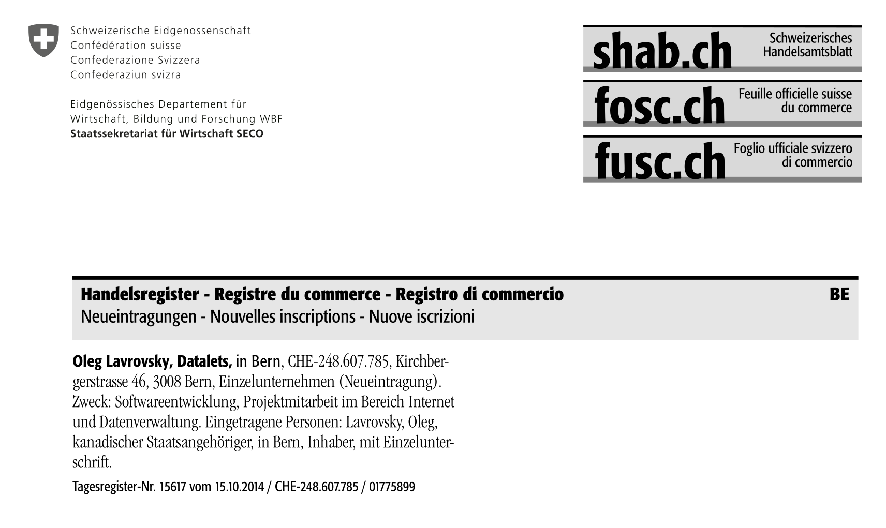

# dat.alets.ch

Plain HTML web site, with a list of projects in the [Data Package](docs/data/datapackage.json) and CSV format.

See it live at https://dat.alets.ch

## Data

In [projects.csv](docs/data/projects.csv), I list the _"why", "when", "where", "what"_ of engagements that make up my portfolio. This is used to generate a graph on my home page (some more details of this below). Screenshot of the root of the graph:

In [revenues.csv](docs/data/revenues.csv), you can see the income that some of these activities generated:

For the history buffs, I have also included an excerpt from my first publication in the commercial registry:

Note that the address is no longer valid - if you are stopping by in Bern, you're best off looking for me at [Effinger](https://effinger.ch).

## Technical

The projects are loaded with [Papa Parse](https://www.papaparse.com/) and rendered as a [GitGraph](https://github.com/nicoespeon/gitgraph.js/), intended for use as a portfolio and small geeky home page - styled using the lightweight and beautiful [Picnic template](https://picnicss.com/).

## Development

To start a dev server:

`yarn && yarn start`

## License

This work is licensed under CC BY 4.0. To view a copy of this license, visit https://creativecommons.org/licenses/by/4.0/
